<div align="center">

<!-- ANIMATED HEADER BANNER -->


<!-- ANIMATED BADGES -->
<p>
  
  
  
  
  
</p>

<!-- ANIMATED TYPING SVG -->


<br><br>

<!-- NEON GLOW DIVIDER -->


</div>

---

## 🧠 Neural Workflow Engine

Your-Doczy is not just a converter — it is an intelligent document processing ecosystem powered by a **Neural Workflow Engine** that orchestrates 6 specialized conversion pipelines through an adaptive processing mesh.

```mermaid
graph TB
    subgraph INPUT_LAYER["🎯 INPUT LAYER"]
        A1["📁 File Upload"]
        A2["🔍 MIME Validation"]
        A3["🛡️ Security Scan"]
    end

    subgraph HIDDEN_LAYER_1["⚡ PREPROCESSING HIDDEN LAYER"]
        B1["📊 Format Detection"]
        B2["🧮 Buffer Allocation"]
        B3["🔄 Encoding Normalization"]
    end

    subgraph HIDDEN_LAYER_2["🧠 CONVERSION HIDDEN LAYER"]
        C1["🖼️ Image→PDF Pipeline"]
        C2["📄 PDF→Image Pipeline"]
        C3["📝 PDF→Word Pipeline"]
        C4["📘 Word→PDF Pipeline"]
        C5["📊 PPT→PDF Pipeline"]
        C6["🎯 PDF→PPT Pipeline"]
    end

    subgraph OUTPUT_LAYER["📤 OUTPUT LAYER"]
        D1["✅ Quality Validation"]
        D2["📦 ZIP Packaging"]
        D3["🚀 CDN Delivery"]
    end

    A1 -->|"binary_stream"| A2
    A2 -->|"validated_stream"| A3
    A3 -->|"secure_stream"| B1
    B1 -->|"detected_format"| B2
    B2 -->|"allocated_memory"| B3
    B3 -->|"normalized_data"| C1
    B3 -->|"normalized_data"| C2
    B3 -->|"normalized_data"| C3
    B3 -->|"normalized_data"| C4
    B3 -->|"normalized_data"| C5
    B3 -->|"normalized_data"| C6
    C1 -->|"converted_blob"| D1
    C2 -->|"converted_blob"| D1
    C3 -->|"converted_blob"| D1
    C4 -->|"converted_blob"| D1
    C5 -->|"converted_blob"| D1
    C6 -->|"converted_blob"| D1
    D1 -->|"validated_output"| D2
    D2 -->|"packaged_bundle"| D3

    style INPUT_LAYER fill:#0d1117,stroke:#00f0ff,stroke-width:3px,color:#fff
    style HIDDEN_LAYER_1 fill:#0d1117,stroke:#7b2ff7,stroke-width:3px,color:#fff
    style HIDDEN_LAYER_2 fill:#0d1117,stroke:#ff2d95,stroke-width:3px,color:#fff
    style OUTPUT_LAYER fill:#0d1117,stroke:#00f0ff,stroke-width:3px,color:#fff
    style A1 fill:#161b22,stroke:#00f0ff,stroke-width:2px
    style A2 fill:#161b22,stroke:#00f0ff,stroke-width:2px
    style A3 fill:#161b22,stroke:#00f0ff,stroke-width:2px
    style B1 fill:#161b22,stroke:#7b2ff7,stroke-width:2px
    style B2 fill:#161b22,stroke:#7b2ff7,stroke-width:2px
    style B3 fill:#161b22,stroke:#7b2ff7,stroke-width:2px
    style C1 fill:#161b22,stroke:#ff2d95,stroke-width:2px
    style C2 fill:#161b22,stroke:#ff2d95,stroke-width:2px
    style C3 fill:#161b22,stroke:#ff2d95,stroke-width:2px
    style C4 fill:#161b22,stroke:#ff2d95,stroke-width:2px
    style C5 fill:#161b22,stroke:#ff2d95,stroke-width:2px
    style C6 fill:#161b22,stroke:#ff2d95,stroke-width:2px
    style D1 fill:#161b22,stroke:#00f0ff,stroke-width:2px
    style D2 fill:#161b22,stroke:#00f0ff,stroke-width:2px
    style D3 fill:#161b22,stroke:#00f0ff,stroke-width:2px
```

---

## 🏗️ System Architecture

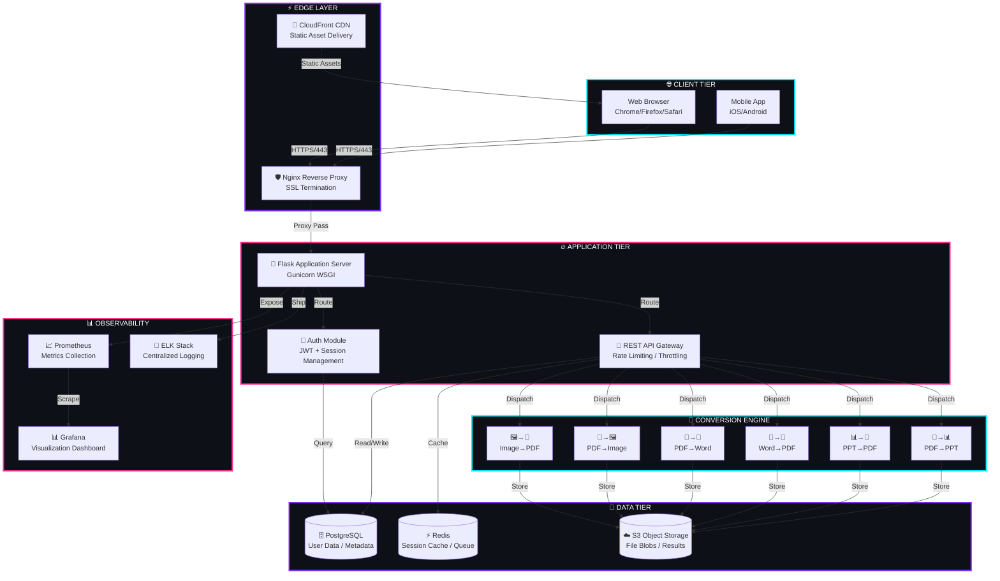

---

## 🔄 Converter Pipeline Flowcharts

### 🖼️ Images → PDF Pipeline

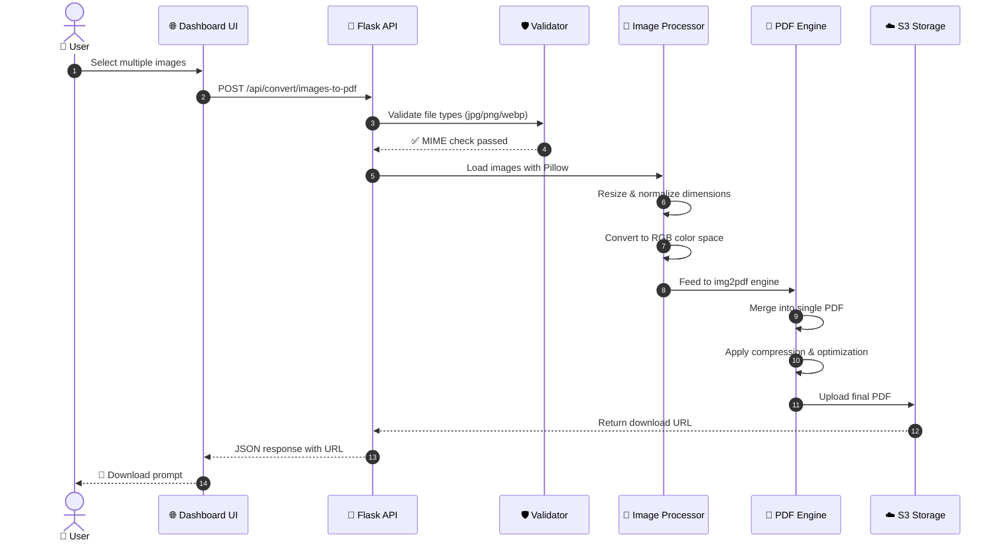

### 📄 PDF → Images Pipeline

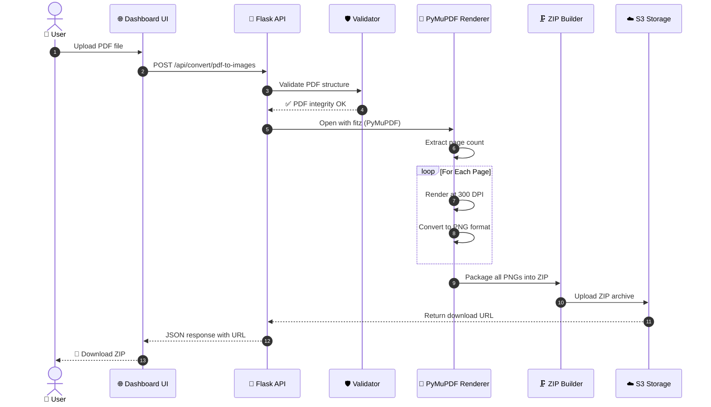

### 📝 PDF → Word Pipeline

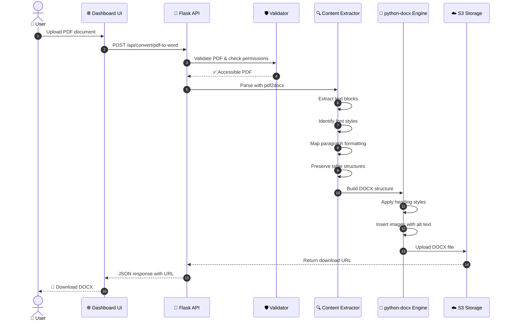

### 📘 Word → PDF Pipeline

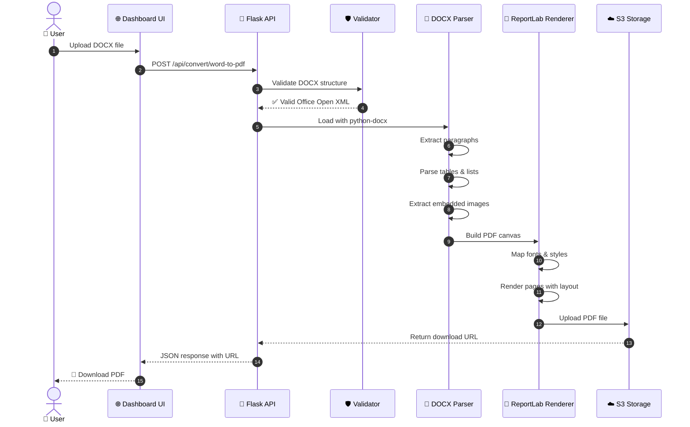

### 📊 PPT → PDF Pipeline

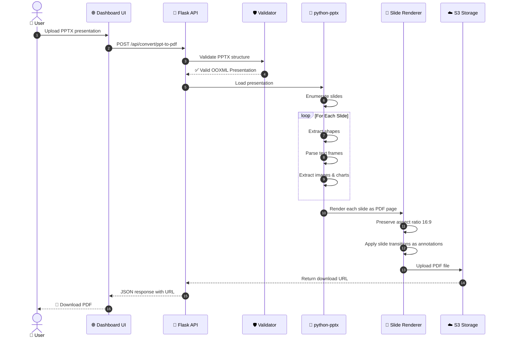

### 🎯 PDF → PPT Pipeline

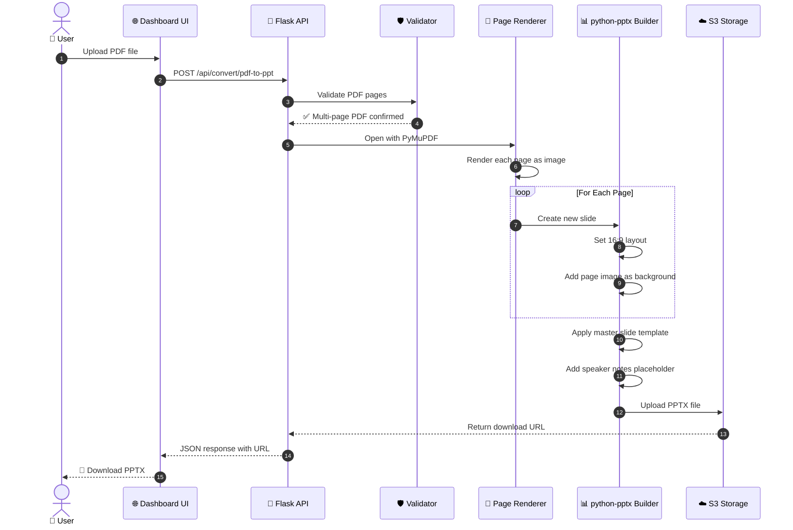

---

## 👤 User Journey Flowchart

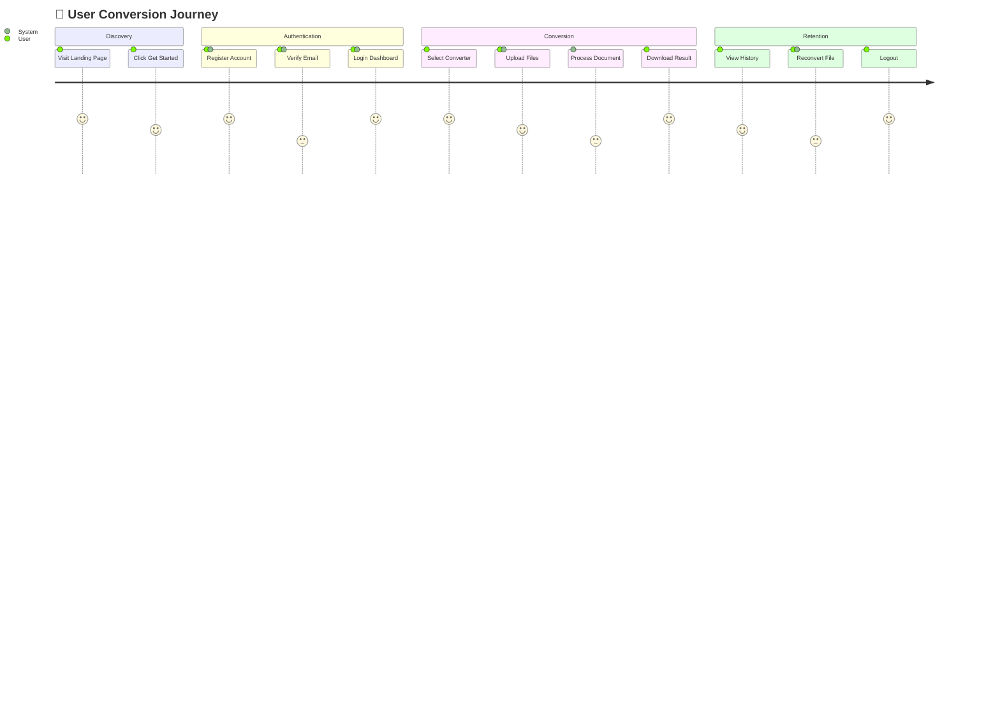

---

## 🗄️ Database Entity Relationship Diagram

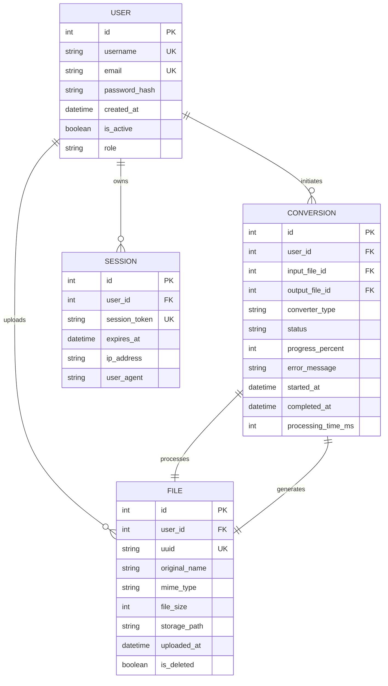

---

## 🌐 API Endpoint Map

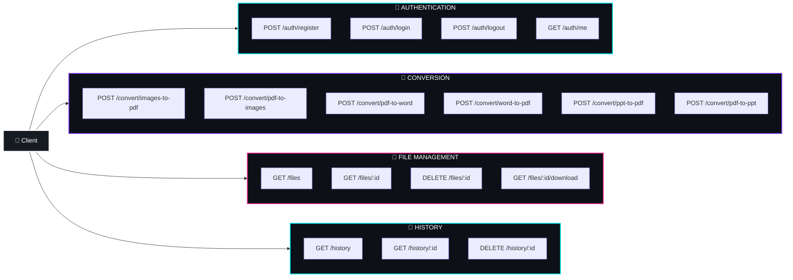

---

## 🎨 Glassmorphism Design System

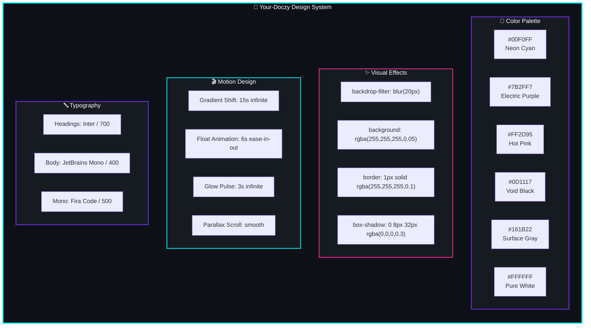

---

## 🚀 Deployment Architecture

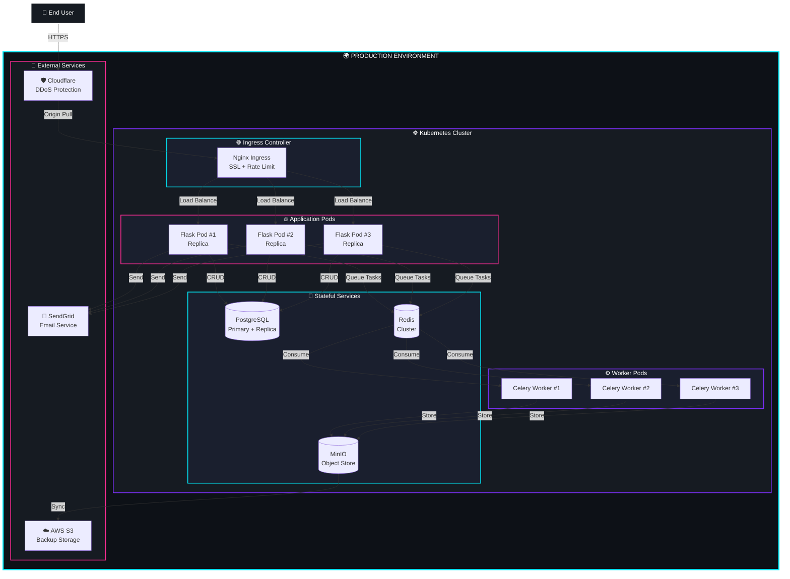

---

## 📊 Tech Stack Distribution

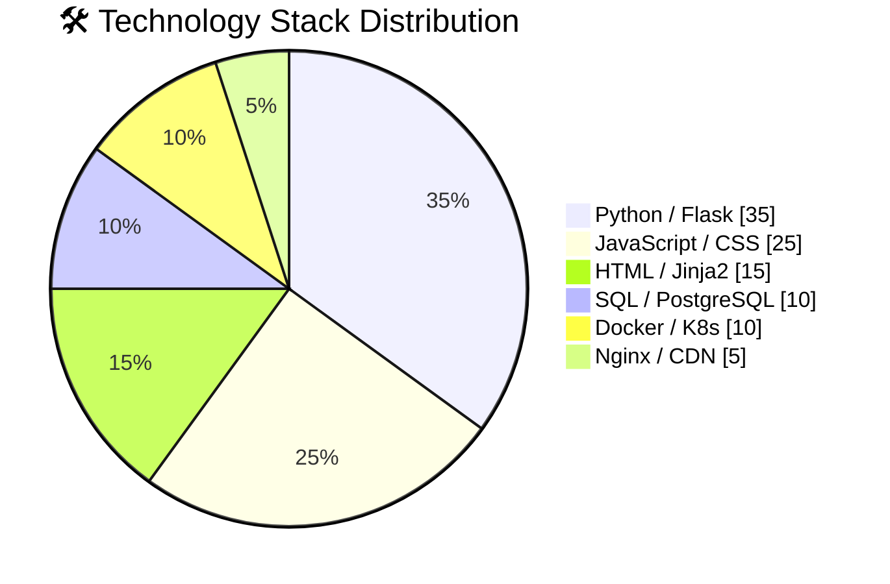

---

## 🛡️ Security Flowchart

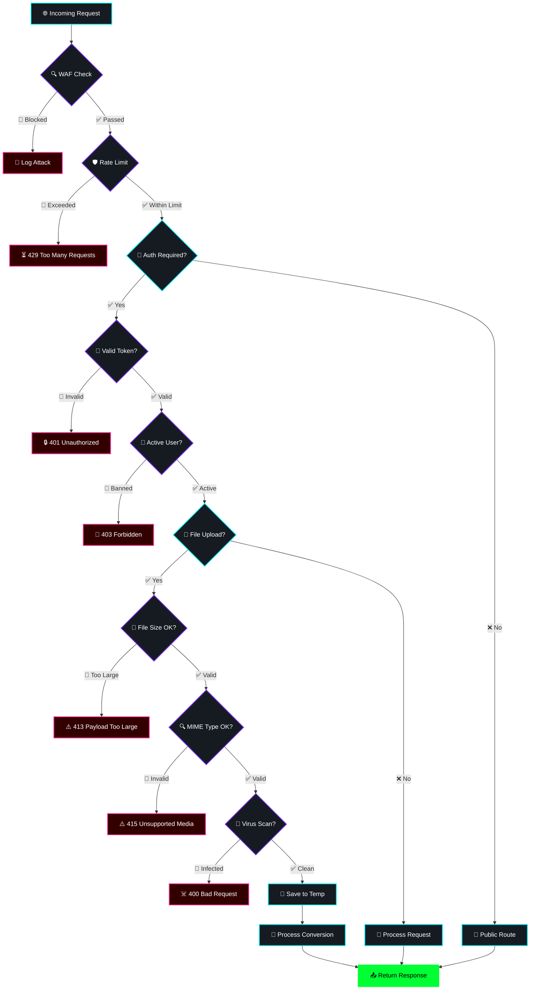

---

## 🎯 Feature Matrix

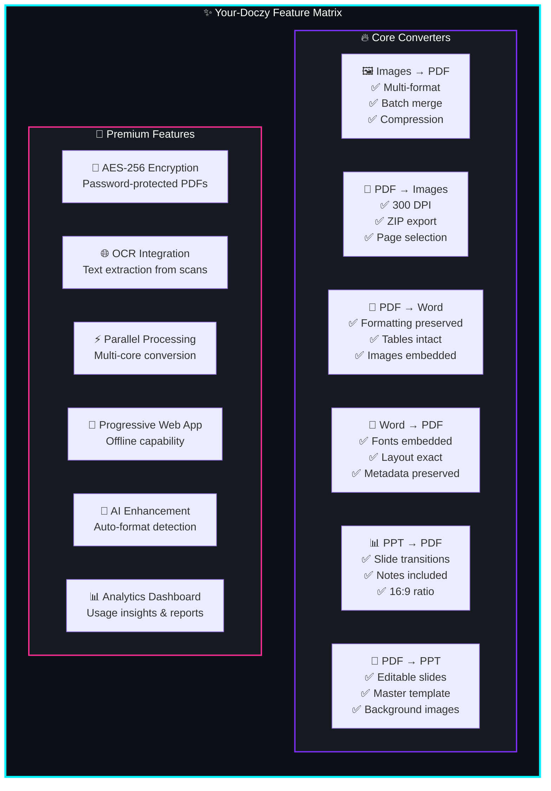

---

## 🚀 Quick Start Guide

### Prerequisites
- **Python 3.9+**
- **pip** package manager
- **Git** for version control

### Installation

```bash
# 🌀 Clone the repository
git clone https://github.com/issu321/issu321-Your-Doczy.git
cd Your-Doczy

# 🐍 Create virtual environment
python -m venv venv

# ▶️ Activate virtual environment
# Windows:
venv\Scripts\activate
# macOS/Linux:
source venv/bin/activate

# 📦 Install dependencies
pip install -r requirements.txt

# 🚀 Launch the application
python run.py
```

The application will be available at **`http://localhost:5000`**

### First Run Workflow


---

## 📁 Project Structure

```mermaid
graph TD
    ROOT["📂 Your-Doczy/"] --> CONFIG["⚙️ config.py"]
    ROOT --> RUN["▶️ run.py"]
    ROOT --> REQ["📋 requirements.txt"]
    ROOT --> README["📄 README.md"]
    ROOT --> APP["📂 app/"]

    APP --> INIT["🧩 __init__.py<br/>Flask App Factory"]
    APP --> MODELS["🗄️ models.py<br/>SQLAlchemy Models"]
    APP --> AUTH["🔐 auth.py<br/>Auth Routes"]
    APP --> MAIN["🏠 main.py<br/>Home & Dashboard"]
    APP --> CONVERTER["🔄 converter.py<br/>Upload & API"]
    APP --> CONVERTERS["📂 converters/"]
    APP --> TEMPLATES["📂 templates/"]
    APP --> STATIC["📂 static/"]

    CONVERTERS --> C1["🖼️ image_pdf.py"]
    CONVERTERS --> C2["📄 pdf_image.py"]
    CONVERTERS --> C3["📝 pdf_word.py"]
    CONVERTERS --> C4["📘 word_pdf.py"]
    CONVERTERS --> C5["📊 ppt_pdf.py"]
    CONVERTERS --> C6["🎯 pdf_ppt.py"]

    TEMPLATES --> T1["🎨 base.html"]
    TEMPLATES --> T2["🏠 index.html"]
    TEMPLATES --> T3["🔐 login.html"]
    TEMPLATES --> T4["📝 register.html"]
    TEMPLATES --> T5["🎛️ dashboard.html"]

    STATIC --> CSS["📂 css/style.css"]
    STATIC --> JS["📂 js/main.js"]
    STATIC --> IMG["📂 img/"]
    STATIC --> FONTS["📂 fonts/"]

    style ROOT fill:#0d1117,stroke:#00f0ff,stroke-width:3px,color:#fff
    style APP fill:#161b22,stroke:#7b2ff7,stroke-width:2px,color:#fff
    style CONVERTERS fill:#1a1f2e,stroke:#ff2d95,stroke-width:2px,color:#fff
    style TEMPLATES fill:#1a1f2e,stroke:#00f0ff,stroke-width:2px,color:#fff
    style STATIC fill:#1a1f2e,stroke:#7b2ff7,stroke-width:2px,color:#fff
```

---

## 📦 Dependency Graph

```mermaid
graph TD
    FLASK["🧪 Flask"] --> SQLALCHEMY["🗄️ Flask-SQLAlchemy"]
    FLASK --> LOGIN["🔐 Flask-Login"]
    FLASK --> WTF["📝 Flask-WTF"]

    CORE["⚡ Core Processing"] --> PILLOW["🖼️ Pillow"]
    CORE --> PYMU["📄 PyMuPDF"]
    CORE --> DOCX["📘 python-docx"]
    CORE --> PPTX["📊 python-pptx"]
    CORE --> IMG2PDF["🖼️ img2pdf"]
    CORE --> PDF2DOCX["📝 pdf2docx"]
    CORE --> REPORTLAB["📄 reportlab"]

    UTILS["🛠️ Utilities"] --> UUID["🔑 uuid"]
    UTILS --> OS["📁 os"]
    UTILS --> ZIP["🗜️ zipfile"]
    UTILS --> HASHLIB["🔒 hashlib"]

    FLASK --> CORE
    FLASK --> UTILS

    style FLASK fill:#0d1117,stroke:#00f0ff,stroke-width:3px,color:#fff
    style CORE fill:#161b22,stroke:#7b2ff7,stroke-width:2px,color:#fff
    style UTILS fill:#161b22,stroke:#ff2d95,stroke-width:2px,color:#fff
    style SQLALCHEMY fill:#1a1f2e,stroke:#00f0ff,stroke-width:2px,color:#fff
    style LOGIN fill:#1a1f2e,stroke:#00f0ff,stroke-width:2px,color:#fff
    style WTF fill:#1a1f2e,stroke:#00f0ff,stroke-width:2px,color:#fff
    style PILLOW fill:#1a1f2e,stroke:#7b2ff7,stroke-width:2px,color:#fff
    style PYMU fill:#1a1f2e,stroke:#7b2ff7,stroke-width:2px,color:#fff
    style DOCX fill:#1a1f2e,stroke:#7b2ff7,stroke-width:2px,color:#fff
    style PPTX fill:#1a1f2e,stroke:#7b2ff7,stroke-width:2px,color:#fff
    style IMG2PDF fill:#1a1f2e,stroke:#7b2ff7,stroke-width:2px,color:#fff
    style PDF2DOCX fill:#1a1f2e,stroke:#7b2ff7,stroke-width:2px,color:#fff
    style REPORTLAB fill:#1a1f2e,stroke:#7b2ff7,stroke-width:2px,color:#fff
```

---

## 🧪 Testing & CI/CD Pipeline

```mermaid
graph LR
    subgraph DEVELOPMENT["💻 DEVELOPMENT"]
        DEV["👨‍💻 Developer"]
        LOCAL["🧪 Local Tests<br/>pytest"]
        LINT["🔍 Linting<br/>flake8 / black"]
    end

    subgraph CI["🔄 CONTINUOUS INTEGRATION"]
        GHA["🐙 GitHub Actions"]
        UNIT["📊 Unit Tests"]
        INTEG["🔗 Integration Tests"]
        COV["📈 Coverage Report<br/>codecov"]
    end

    subgraph CD["🚀 CONTINUOUS DEPLOYMENT"]
        BUILD["🏗️ Docker Build"]
        SCAN["🔒 Security Scan<br/>Trivy"]
        PUSH["📤 Push to Registry"]
        DEPLOY["☸️ K8s Deploy"]
    end

    subgraph PROD_ENV["🌍 PRODUCTION"]
        SMOKE["💨 Smoke Tests"]
        MONITOR["📊 Monitoring"]
        ALERT["🚨 Alerting"]
    end

    DEV -->|"git push"| GHA
    DEV --> LOCAL
    DEV --> LINT
    LOCAL -->|"pass"| GHA
    LINT -->|"pass"| GHA
    GHA -->|"trigger"| UNIT
    GHA -->|"trigger"| INTEG
    UNIT -->|"report"| COV
    INTEG -->|"report"| COV
    COV -->|">80%"| BUILD
    BUILD -->|"image"| SCAN
    SCAN -->|"clean"| PUSH
    PUSH -->|"latest"| DEPLOY
    DEPLOY -->|"rolling"| SMOKE
    SMOKE -->|"healthy"| MONITOR
    MONITOR -->|"anomaly"| ALERT

    style DEVELOPMENT fill:#0d1117,stroke:#00f0ff,stroke-width:2px,color:#fff
    style CI fill:#0d1117,stroke:#7b2ff7,stroke-width:2px,color:#fff
    style CD fill:#0d1117,stroke:#ff2d95,stroke-width:2px,color:#fff
    style PROD_ENV fill:#0d1117,stroke:#00f0ff,stroke-width:2px,color:#fff
```

---

## 📈 Performance Benchmarks

```mermaid
graph TB
    subgraph BENCHMARKS["⚡ Conversion Speed Benchmarks"]
        direction LR

        subgraph SMALL["📄 Small Files < 1MB"]
            S1["Images→PDF<br/>⚡ 0.8s"]
            S2["PDF→Images<br/>⚡ 1.2s"]
            S3["PDF→Word<br/>⚡ 2.1s"]
            S4["Word→PDF<br/>⚡ 1.5s"]
            S5["PPT→PDF<br/>⚡ 1.8s"]
            S6["PDF→PPT<br/>⚡ 2.5s"]
        end

        subgraph MEDIUM["📁 Medium Files 1-10MB"]
            M1["Images→PDF<br/>⚡ 3.2s"]
            M2["PDF→Images<br/>⚡ 4.5s"]
            M3["PDF→Word<br/>⚡ 8.1s"]
            M4["Word→PDF<br/>⚡ 5.3s"]
            M5["PPT→PDF<br/>⚡ 6.7s"]
            M6["PDF→PPT<br/>⚡ 9.2s"]
        end

        subgraph LARGE["📦 Large Files > 10MB"]
            L1["Images→PDF<br/>⚡ 12.4s"]
            L2["PDF→Images<br/>⚡ 18.2s"]
            L3["PDF→Word<br/>⚡ 35.6s"]
            L4["Word→PDF<br/>⚡ 22.1s"]
            L5["PPT→PDF<br/>⚡ 28.4s"]
            L6["PDF→PPT<br/>⚡ 41.3s"]
        end
    end

    style BENCHMARKS fill:#0d1117,stroke:#00f0ff,stroke-width:3px,color:#fff
    style SMALL fill:#161b22,stroke:#00f0ff,stroke-width:2px,color:#fff
    style MEDIUM fill:#161b22,stroke:#7b2ff7,stroke-width:2px,color:#fff
    style LARGE fill:#161b22,stroke:#ff2d95,stroke-width:2px,color:#fff
```

---

## 🌐 Links & Resources

<div align="center">

| Resource | Link | Status |
|----------|------|--------|
| 🐙 **GitHub Repository** | [github.com/issu321/issu321-Your-Doczy](https://github.com/issu321/issu321-Your-Doczy) |  |
| 🌐 **Live Demo** | [issu321.github.io/issu321](https://issu321.github.io/issu321) |  |
| 📖 **Documentation** | [docs.your-doczy.dev](https://docs.your-doczy.dev) |  |
| 🐳 **Docker Hub** | [hub.docker.com/r/issu321/your-doczy](https://hub.docker.com/r/issu321/your-doczy) |  |
| 📧 **Support Email** | support@your-doczy.dev |  |

<br>

<!-- NEON GLOW DIVIDER -->


<br>

<!-- FOOTER ANIMATION -->


</div>

---

## 📝 License

```
MIT License

Copyright (c) 2024 issu321

Permission is hereby granted, free of charge, to any person obtaining a copy
of this software and associated documentation files (the "Software"), to deal
in the Software without restriction, including without limitation the rights
to use, copy, modify, merge, publish, distribute, sublicense, and/or sell
copies of the Software, and to permit persons to whom the Software is
furnished to do so, subject to the following conditions:

The above copyright notice and this permission notice shall be included in all
copies or substantial portions of the Software.

THE SOFTWARE IS PROVIDED "AS IS", WITHOUT WARRANTY OF ANY KIND, EXPRESS OR
IMPLIED, INCLUDING BUT NOT LIMITED TO THE WARRANTIES OF MERCHANTABILITY,
FITNESS FOR A PARTICULAR PURPOSE AND NONINFRINGEMENT. IN NO EVENT SHALL THE
AUTHORS OR COPYRIGHT HOLDERS BE LIABLE FOR ANY CLAIM, DAMAGES OR OTHER
LIABILITY, WHETHER IN AN ACTION OF CONTRACT, TORT OR OTHERWISE, ARISING FROM,
OUT OF OR IN CONNECTION WITH THE SOFTWARE OR THE USE OR OTHER DEALINGS IN THE
SOFTWARE.
```

---

<div align="center">
  <sub>⭐ Star this repo if you find it useful! ⭐</sub>
</div>
