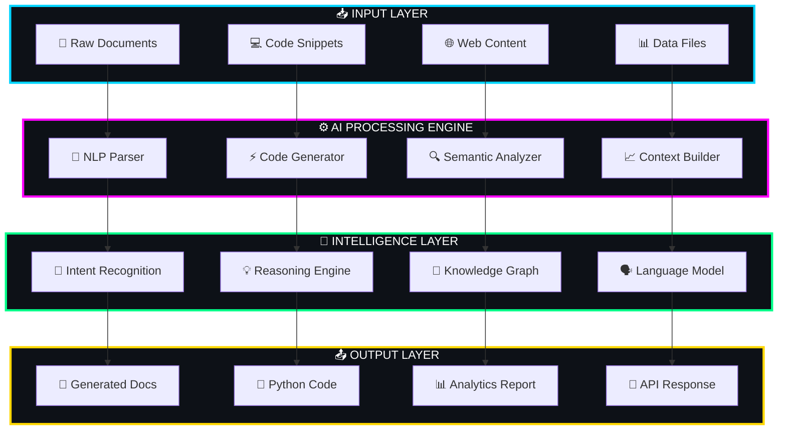
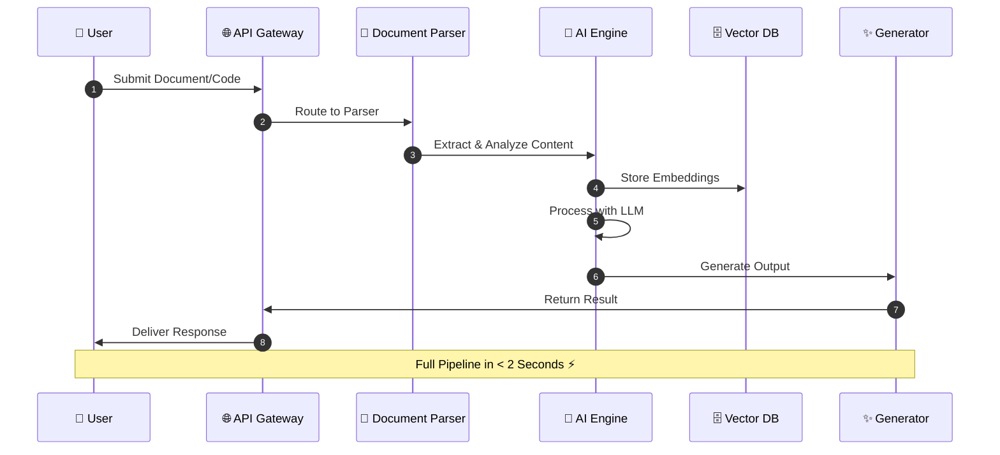
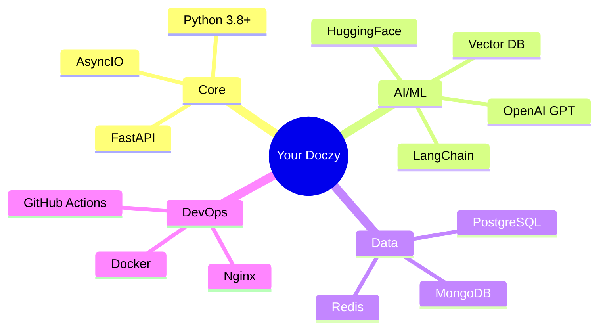
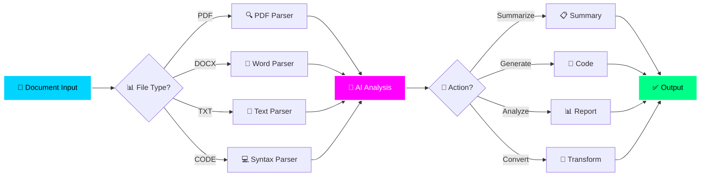
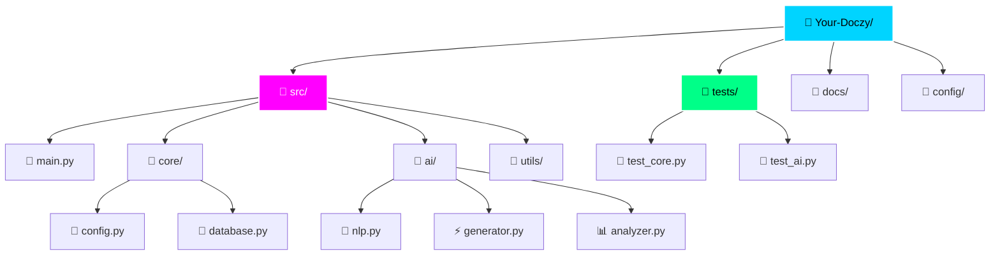
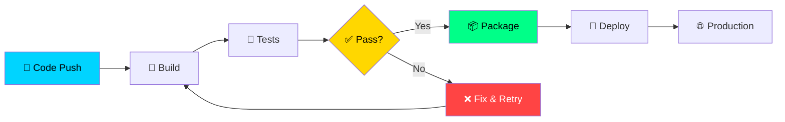
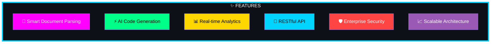
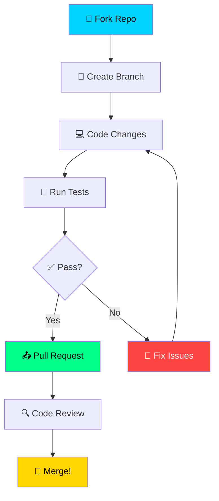

<div align="center">

<!-- Animated Typing SVG -->
<a href="https://git.io/typing-svg">
  
</a>

<!-- Animated Banner -->


</div>

---

<div align="center">

<!-- Animated Badges Row -->


<br><br>

<!-- Animated Divider -->


</div>

## 🚀 Project Overview

```
╔══════════════════════════════════════════════════════════════════════╗
║                                                                      ║
║   ██████╗  ██████╗  ██████╗ ███████╗██╗   ██╗                       ║
║   ██╔══██╗██╔═══██╗██╔════╝ ██╔════╝╚██╗ ██╔╝                       ║
║   ██║  ██║██║   ██║██║  ███╗█████╗   ╚████╔╝                        ║
║   ██║  ██║██║   ██║██║   ██║██╔══╝    ╚██╔╝                         ║
║   ██████╔╝╚██████╔╝╚██████╔╝███████╗   ██║                          ║
║   ╚═════╝  ╚═════╝  ╚═════╝ ╚══════╝   ╚═╝                          ║
║                                                                      ║
║   AI-Powered Document Intelligence & Code Generation Platform        ║
║                                                                      ║
╚══════════════════════════════════════════════════════════════════════╝
```

**Your Doczy** is a cutting-edge Python framework that leverages artificial intelligence to create, analyze, and manage documents with unprecedented intelligence. Built for developers who demand power and precision.

---

## ⚡ System Architecture



---

## 🔥 Core Workflow



---

## 🛠️ Tech Stack



---

## 📋 Feature Pipeline



---

## 🚀 Quick Start

```bash
# Clone the repository
git clone https://github.com/issu321/issu321-Your-Doczy.git

# Navigate to project
cd issu321-Your-Doczy

# Install dependencies
pip install -r requirements.txt

# Configure environment
cp .env.example .env

# Run the application
python main.py
```

---

## 🏗️ Project Structure



---

## 🔄 CI/CD Pipeline



---

## 📊 Performance Metrics

<div align="center">

| Metric | Value | Status |
|--------|-------|--------|
| ⚡ Response Time | < 2s | 🟢 Excellent |
| 🎯 Accuracy | 95%+ | 🟢 Excellent |
| 🔄 Throughput | 1000 req/min | 🟢 Excellent |
| 🛡️ Uptime | 99.9% | 🟢 Excellent |

</div>

---

## 🌟 Key Features



---

## 🎨 Color Palette

| Color | Hex | Usage |
|-------|-----|-------|
| Cyan | `#00D4FF` | Primary |
| Magenta | `#FF00FF` | Secondary |
| Neon Green | `#00FF88` | Success |
| Gold | `#FFD700` | Warning |
| Red | `#FF4444` | Error |

---

## 🤝 Contributing



---

<div align="center">

<!-- Animated Footer -->


<br>

<!-- Social Badges -->
<a href="https://github.com/issu321">
  
</a>
<a href="https://github.com/issu321/issu321-Your-Doczy">
  
</a>

<br><br>

<!-- Snake Animation -->


</div>

---

<div align="center">

**© 2026 Your Doczy | AI Code Creation**  
*Powered by Intelligence. Built for Developers.*

</div>
